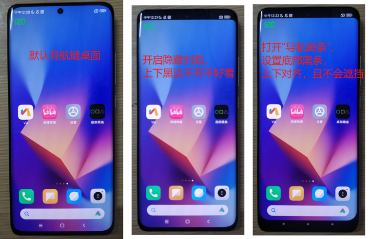
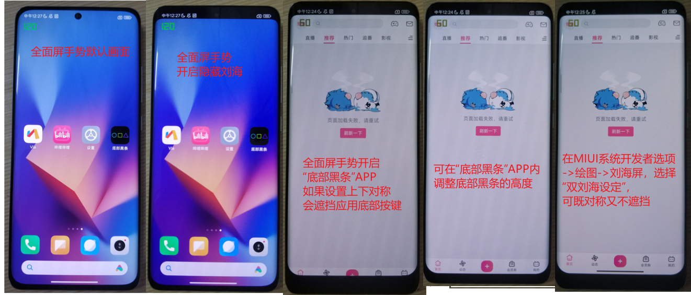
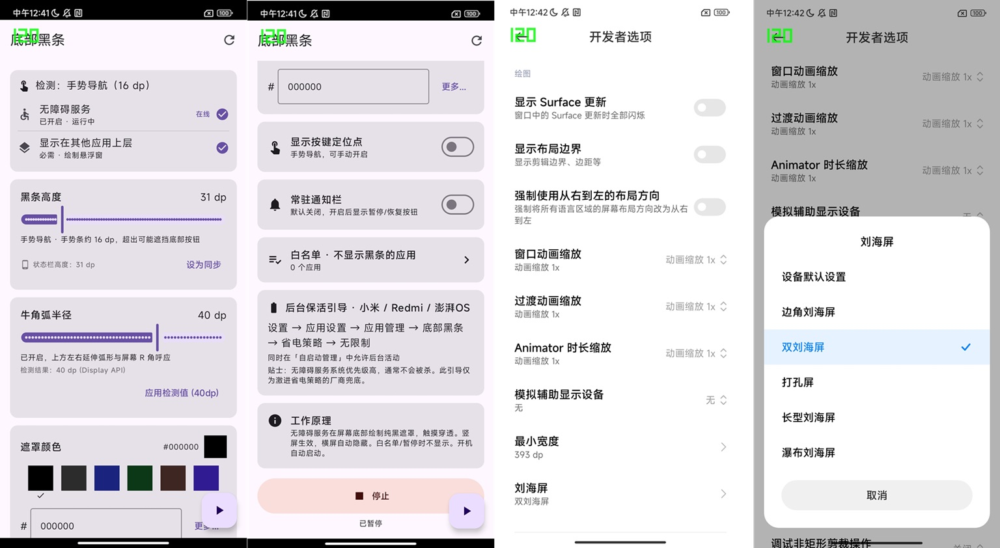

# Navi Overlay（底部黑条）

在 Android 12+ 设备上，在屏幕底部绘制一条遮罩，与顶部系统状态栏（挖孔/刘海隐藏后）形成**视觉对称**。专为无法接受挖孔屏、开启"隐藏刘海"后觉得头重脚低不对称不舒服的用户设计。

## 功能特性

- **视觉对称**：底部遮罩与状态栏等高，上下呼应
- **手势导航友好**：默认仅覆盖手势条高度，避免遮挡底部导航按钮
- **R角匹配**：遮罩顶部两端弧形延伸，与手机物理圆角视觉呼应
- **可自定义颜色**：预设(纯黑) + 十六进制 + RGB 滑块
- **白名单**：指定 App 在前台时自动隐藏遮罩
- **无障碍服务保活**：系统级高优先级，不易被后台清理杀死
- **开机自启**：开启无障碍后，无需额外配置
- **常驻通知（可选）**：默认关闭，用户可选择开启

## 安装下载

直接在 [release](https://github.com/Sanotsu/navi-overlay/releases) 下载安装即可。

## 效果截图

我的开发机是小米12S的MIUI14.0.3.0版本，其他品牌型号不一定通用，请自测和反馈，谢谢。

MIUI默认有两种系统导航方式：

1. 经典导航栏



2. 全面屏手势



3. APP截图和双刘海屏设定



## 环境要求

| 项次           | 版本                   |
| -------------- | ---------------------- |
| Android SDK    | 31 (Android 12) 及以上 |
| JDK            | 17+（推荐 21）         |
| Gradle Wrapper | 项目自带               |
| 设备           | Android 12+ 真机       |

## 项目结构

```
.
├── app/
│   ├── build.gradle.kts              # 编译配置（签名 / R8 / Compose）
│   ├── proguard-rules.pro            # 混淆规则
│   └── src/main/
│       ├── AndroidManifest.xml       # 权限 + 服务声明
│       ├── kotlin/com/swm/navi_overlay/
│       │   ├── MainActivity.kt               # Compose UI（设置主页 + 颜色选择器 + 弹窗）
│       │   ├── WhitelistScreen.kt            # 白名单管理页
│       │   ├── OverlayA11yService.kt         # 核心：无障碍服务（遮罩绘制 + 前台检测 + 横竖屏）
│       │   ├── BarView.kt                    # 自定义 View（4 层渲染 pipeline）
│       │   ├── OverlayPrefs.kt               # SharedPreferences 持久化
│       │   ├── NavUtils.kt                   # 导航栏 / 状态栏 / 屏幕 R 角检测
│       │   ├── A11yUtils.kt                  # 无障碍开启检测 / 设置跳转
│       │   ├── ManufacturerUtils.kt          # 厂商识别 + 后台保活引导文案
│       │   ├── NoticeHelper.kt               # 可选常驻通知
│       │   ├── NoticeActionReceiver.kt       # 通知按钮（暂停 / 恢复 / 停止）
│       │   └── BootReceiver.kt               # 开机自启兜底
│       └── res/
│           ├── xml/accessibility_service_config.xml
│           └── values/strings.xml
├── gradlew / gradlew.bat              # Gradle Wrapper
├── local.properties                   # SDK 路径 + 签名配置（不提交 git）
├── navi-overlay.jks                   # Release 签名密钥（不提交 git）
├── settings.gradle.kts
└── build.gradle.kts
```

## 快速开始

### 安装运行

```bash
# 安装到 USB 连接的真机
gradlew.bat installDebug

# 启动
adb shell am start -n com.swm.navi_overlay/.MainActivity

# 查看日志
adb logcat | findstr "com.swm.navi_overlay"
```

### 首次配置（一次性）

1. 打开 App → 点击顶栏刷新按钮
2. **开启无障碍服务**（系统会自动跳转设置页）
   - 这是核心，提供保活 + 开机自启 + 前台 App 检测
3. **（可选）授予"显示在其他应用上层"** ← 使用 TYPE_ACCESSIBILITY_OVERLAY 后不再强制要求
4. **参考状态栏高度**设置黑条高度（卡片底部显示"状态栏高度：37 dp"，点击「设为同步」）
5. 调整牛角弧半径使顶部弧度与手机物理 R 角协调
6. 选择遮罩颜色（默认纯黑）
7. 点 **「启动黑条」**
8. **（推荐）** 按引导锁定后台（防止厂商激进杀进程）

### 打包 Release

#### 1. 生成签名密钥（仅首次，只需做一次）

**Windows（PowerShell）**

```powershell
# 找到 keytool（JDK 自带，通常在 JAVA_HOME\bin 下）
& "$env:JAVA_HOME\bin\keytool.exe" -genkey -v `
  -keystore navi-overlay.jks `
  -keyalg RSA -keysize 2048 -validity 10000 `
  -alias navi-overlay `
  -storepass 你的密钥库密码 `
  -keypass 你的密钥密码 `
  -dname "CN=你的名字, OU=Dev, O=个人, L=城市, ST=省份, C=CN"
```

**Windows（CMD）**

```cmd
"%JAVA_HOME%\bin\keytool.exe" -genkey -v ^
  -keystore navi-overlay.jks ^
  -keyalg RSA -keysize 2048 -validity 10000 ^
  -alias navi-overlay ^
  -storepass 你的密钥库密码 ^
  -keypass 你的密钥密码 ^
  -dname "CN=你的名字, OU=Dev, O=个人, L=城市, ST=省份, C=CN"
```

**Linux / macOS（Bash）**

```bash
keytool -genkey -v \
  -keystore navi-overlay.jks \
  -keyalg RSA -keysize 2048 -validity 10000 \
  -alias navi-overlay \
  -storepass 你的密钥库密码 \
  -keypass 你的密钥密码 \
  -dname "CN=你的名字, OU=Dev, O=个人, L=城市, ST=省份, C=CN"
```

> **说明**：`keytool` 是 JDK 自带工具，无需额外安装。如果找不到，先确认 `JAVA_HOME` 环境变量已配置。
>
> `-validity 10000` 表示证书有效期约 27 年。

#### 2. 填写 local.properties

生成 `.jks` 文件后，在项目根目录的 `local.properties` 中填入签名信息：

```properties
sdk.dir=D\:\\DevEnv\\Android\\Sdk

# Release 签名配置
release.keyAlias=navi-overlay
release.keyPassword=你的密钥密码
release.storePassword=你的密钥库密码
release.storeFile=navi-overlay.jks
```

> **安全提示**：
>
> - `local.properties` 和 `navi-overlay.jks` 已在 `.gitignore` 中，不会被提交到 Git
> - 如果换设备开发，需同时备份 `.jks` 文件和密码。**密钥丢失后将无法对同一包名签发更新**

#### 3. 打包

```bash
# Windows（PowerShell / CMD）
gradlew.bat assembleRelease

# Linux / macOS
./gradlew assembleRelease

### 如果没有gradle-wrapper.jar，先下载
# 1. 确保目录存在
mkdir -Force gradle\wrapper

# 2. 使用 PowerShell 下载 gradle-wrapper.jar
Invoke-WebRequest -Uri "https://raw.githubusercontent.com/gradle/gradle/v8.14.0/gradle/wrapper/gradle-wrapper.jar" -OutFile "gradle\wrapper\gradle-wrapper.jar"

# 如果上面不行，试试这个镜像：
# Invoke-WebRequest -Uri "https://repo1.maven.org/maven2/org/gradle/gradle-wrapper/8.14/gradle-wrapper-8.14.jar" -OutFile "gradle\wrapper\gradle-wrapper.jar"
```

#### 4. 输出

| 平台            | 路径                                            |
| --------------- | ----------------------------------------------- |
| Windows / Linux | `app/build/outputs/apk/release/app-release.apk` |

APK 体积约 **2.5MB**（R8 混淆 + 资源压缩 + Compose）。

#### 5. 安装到设备

```bash
# ADB 安装（所有平台通用）
adb install -r app/build/outputs/apk/release/app-release.apk
```

#### 6. 版本号管理

发布新版本前，修改 `app/build.gradle.kts` 中的版本号：

```kotlin
defaultConfig {
    versionCode = 2       // 整数，每次发布 +1
    versionName = "0.1.0-beta.1" // 展示给用户的版本号
}
```

#### 7. 打包前后尺寸对比

| 阶段                         | 体积       | 说明                            |
| ---------------------------- | ---------- | ------------------------------- |
| Debug（未混淆）              | ~55MB      | 含调试符号、完整 Compose 运行时 |
| Release（R8 未开）           | ~40MB      | 仅去除调试信息                  |
| **Release（R8 + 资源压缩）** | **~2.5MB** | 当前方案                        |

#### 打包注意事项

- **JDK 版本**：项目 `compileOptions` 指定 Java 17，推荐使用 JDK 17 或 21 编译。如果 keytool 报版本不兼容，检查 `gradle.properties` 中的 `org.gradle.jvmargs`
- **Gradle 版本**：需使用项目自带的 Gradle Wrapper（`gradlew` / `gradlew.bat`），不要用系统全局 Gradle
- **签名警告**：Release 构建必须成功签名。如果 `local.properties` 中的密钥路径或密码有误，构建会失败
- **首次构建耗时**：首次 `assembleRelease` 会下载 Compose BOM 依赖（约 5~10 分钟），后续构建利用缓存只需数秒

## 核心设计

### 渲染管线（4 层）

遮罩的颜色由 4 层叠加决定，排查透明度问题需逐层检查：

```
┌────────────────────────────────────────────────────┐
│ 1. Surface 像素格式 (PixelFormat)                   │
│    牛角关闭 → RGBX_8888（无 alpha 通道，不可混合）    │
│    牛角开启 → RGBA_8888（有 alpha，允许透明）         │
│    ↑ SurfaceFlinger 合成器根据这层决定是否做 α 混合   │
├────────────────────────────────────────────────────┤
│ 2. View 背景 (setBackgroundColor)                   │
│    牛角关闭 → 遮罩颜色（不透明）                      │
│    牛角开启 → TRANSPARENT（Path 决定填充区域）        │
│    ↑ 系统在 onDraw 之前先画这层                      │
├────────────────────────────────────────────────────┤
│ 3. Canvas 绘制 (onDraw → drawColor)                 │
│    canvas.drawColor(color) 填充整个 canvas / clip 区域│
│    ↑ 最终像素色值                                    │
├────────────────────────────────────────────────────┤
│ 4. SurfaceFlinger 合成 (α / dimAmount)              │
│    params.alpha / params.dimAmount                 │
│    ↑ 系统层级的透明度控制                            │
└────────────────────────────────────────────────────┘
```

### 窗口类型选择

| 类型                             | 值       | 需要权限                                     | α 控制           | 适用场景     |
| -------------------------------- | -------- | -------------------------------------------- | ---------------- | ------------ |
| `TYPE_APPLICATION_OVERLAY`       | 2038     | `SYSTEM_ALERT_WINDOW`                        | 系统可能强制降 α | 普通悬浮窗   |
| **`TYPE_ACCESSIBILITY_OVERLAY`** | **2032** | `BIND_ACCESSIBILITY_SERVICE`（无障碍已自带） | 系统不干预       | **当前使用** |

在 MIUI/澎湃 OS 上实测，`TYPE_APPLICATION_OVERLAY` 被系统强制设 `alpha≈0.8`，导致遮罩半透明。改用 `TYPE_ACCESSIBILITY_OVERLAY` 后恢复正常 `alpha=1.0`。

### 牛角弧（R 角）几何

```
  ●(0,0)                                    ●(w,0)     ← 牛角尖
   ╲                                           ╱
    ╲   ← 圆弧（圆心在 (r,0)，屏幕内侧）        ╱
     ●(r,r) ──── 直线 ──── ●(w-r,r)          ← 与矩形主体连接
     ████████████████████████████████████████
     █████████████    矩形主体   █████████████
     ████████████████████████████████████████
```

- **圆心** `(r, 0)` 和 `(w-r, 0)` —— 均在屏幕内侧（x > 0）
- **半径** `r` = 牛角弧半径（0~60dp 可调），建议等于手机物理 R 角
- 弧从尖角 `(0, 0)` 逆时针扫 90° 到 `(r, r)`
- 圆角开启时 View 总高 = 黑条高度 + 牛角半径

### 圆角半径自动检测

```
优先级 1: Display.getRoundedCorner(POSITION_BOTTOM_LEFT) ← API 33+，最准确
优先级 2: 系统资源 rounded_corner_radius / _bottom / config_roundedCornerRadius
优先级 3: 返回 0（用户手动调整）
```

### 颜色选择

默认纯黑 `#000000`。用户可通过以下方式自定义：

- **预设色块**：纯黑 / 炭灰 / 靛蓝 / 墨绿 / 深咖 / 深紫
- **十六进制输入**：`#RRGGBB`
- **RGB 滑块弹窗**：点击预览色块或「更多...」按钮

颜色值持久化在 `SharedPreferences` 中，重启后恢复。

## 关键行为逻辑

### 遮罩显隐规则（`OverlayA11yService.updateVisibility()`）

```
显示：running=true ∧ 未暂停 ∧ 竖屏 ∧ 前台 App 不在白名单
隐藏：以上任一条件不满足
```

- **暂停**：通知栏或 App 内点击暂停，遮罩立即隐藏
- **横屏**：自动隐藏（横屏下刘海在侧边，底部遮罩不对称）
- **白名单**：用户在 App 内勾选"不显示"的应用，进入前台时自动隐藏
- **自身 App 前台**：不特殊处理，遮罩照常显示（用户可直观看到效果）

### 前台 App 检测

基于无障碍服务的 `onAccessibilityEvent(TYPE_WINDOW_STATE_CHANGED)`，实时获取当前前台包名，无额外权限要求。比 `UsageStatsManager` 轮询更实时、更省电。

### 开机自启

无障碍服务在用户系统设置中开启后，系统会在每次开机时自动启动该服务，无需额外 `BootReceiver`。`BootReceiver` 仅作为兜底：若用户开启了常驻通知，开机后重新显示通知。

## 调试

### 查看遮罩层信息（SurfaceFlinger）

```bash
adb shell "dumpsys SurfaceFlinger --layer-list | grep -i -A 15 navi"
```

关注字段：

| 字段                  | 正常值                          | 异常表现                  |
| --------------------- | ------------------------------- | ------------------------- |
| `alpha=`              | `1.000000`                      | `<1` 表示系统降低了透明度 |
| `defaultPixelFormat=` | `RGBX_8888` 或 `RGBA_8888`      | —                         |
| `windowType=`         | `2032`（ACCESSIBILITY_OVERLAY） | `2038` 表示还在用旧类型   |
| `isOpaque=`           | —                               | `true` 更好               |

### 查看日志

```bash
adb logcat -v time *:S System.err:W | findstr "navi"
```

## 技术栈

- **Kotlin**（100%）
- **Jetpack Compose** + Material 3（UI）
- **AccessibilityService**（核心保活 + 前台检测）
- **WindowManager**（系统级悬浮窗绘制）
- **SharedPreferences**（持久化）
- **R8 + ProGuard**（Release 混淆压缩）

---

本说明文档由 DeepSeek V4 Pro 协助编写。
